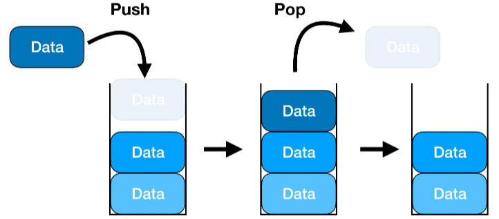
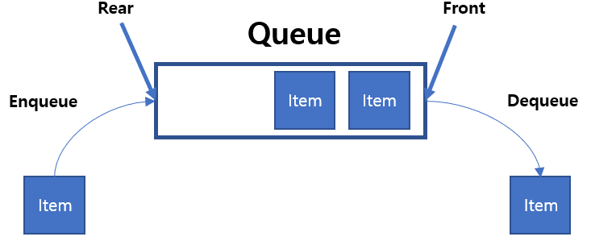
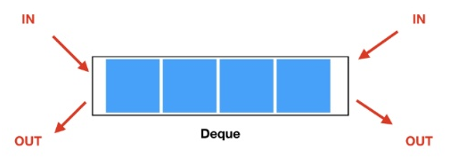

## 스택

LIFO(Last In First Out) 방식으로 동작하는 자료 구조이다. 
한 쪽 방향(top)에서만 자료를 넣고 빼는 작업이 이루어진다.

### 스택 연산 방식
- push: 스택에 데이터 추가
- pop: 스택에 맨 위 데이터를 삭제하며 반환
- peek/top: 맨 위 데이터를 삭제하지 않고 반환

### 스택의 시간 복잡도
- 삽입/삭제: O(1)
  - 항상 맨 위의 데이터를 삽입하거나 삭제 하기 때문
- 검색: O(n)
  - 특정 데이터를 찾을 때까지 수행해야함

## 큐

FIFO(First In First Out) 방식으로 동작하는 자료 구조이다. 
스택과 달리 처음과 끝에서 각각 삽입, 삭제 연산이 이루어진다.

### 큐 연산 방식
- enqueue: 큐 맨 뒤에 데이터 추가
- dequeue: 큐 맨 앞 데이터 삭제하며 반환
- peek/front: 맨 앞 데이터 삭제하지 않고 반환

### 큐의 시간 복잡도
- 삽입/삭제: O(1)
  - 항상 맨 뒤에 데이터를 삽입하거나 맨 앞에 데이터를 삭제 하기 때문
- 검색: O(n)
  - 특정 데이터를 찾을 때까지 수행해야함

## 덱

스택, 큐와 달리 양쪽에서 삽입 삭제가 가능한 자료 구조이다.

### 덱 연산 방식
- addFirst/addLast: 맨 앞/뒤에 데이터 추가
- removeFirst/removeLast: 맨 앞/뒤 데이터 삭제하며 반환
- peekFirst/peekLast: 앞/뒤 데이터 삭제하지 않고 반환

### 덱의 시간 복잡도
- 삽입/삭제: O(1)
- 검색: O(n)
