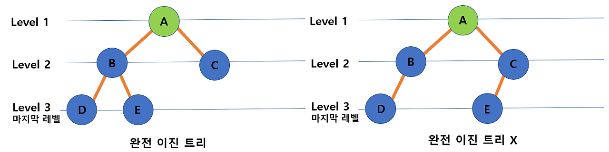
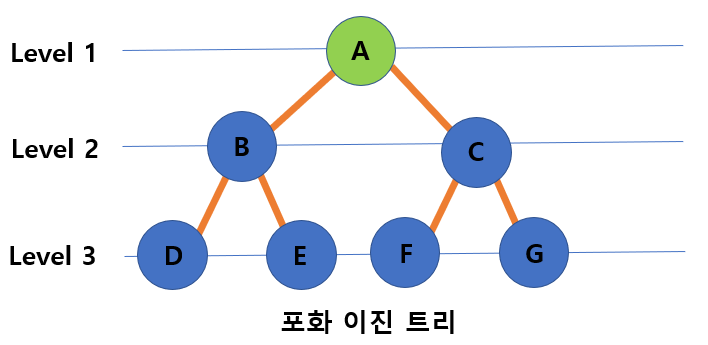
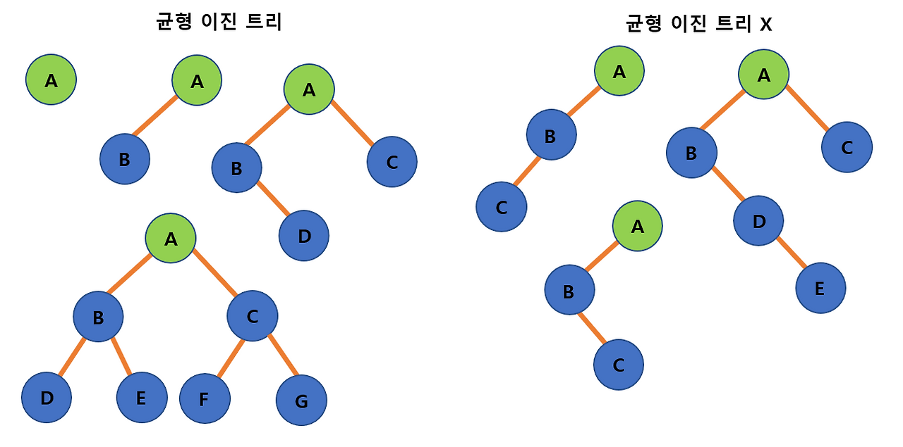
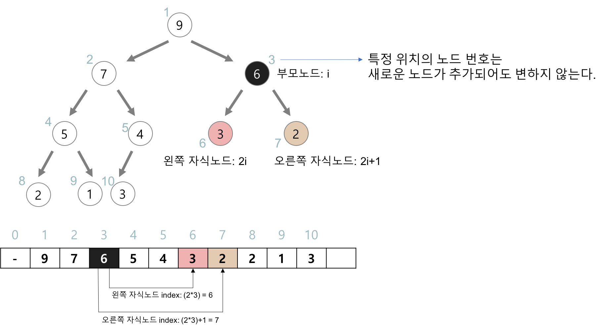

# 트리, 힙 개념정리

## 트리

- 계층적 자료 구조
- 하나의 루트 노드를 기준으로 하위 노드들이 트리처럼 분기됨
- 사이클이 없는 그래프 구조

### 용어 정리


- **루트(Root)**: 트리의 최상위 노드
- **노드(Node)**: 트리의 각 요소
- **간선(Edge)**: 노드 간의 연결선
- **리프(Leaf)**: 자식이 없는 노드
- **서브트리(Subtree)**: 어떤 노드를 루트로 하는 하위 트리
- **차수(Degree)**: 노드가 가지고 있는 자식 노드의 개수
- **레벨(Level)**: 트리에서 깊이가 같은 노드들의 집합
- **높이(Height)**: 트리의 최대 레벨

### 이진 트리(Binary Tree)란?

- 각 노드가 최대 2개의 자식을 가질 수 있는 트리
- 정렬과 검색 알고리즘을 위한 하나의 도구
  - 이진 트리의 모양에 따라 알고리즘 성능에 차이가 있다

**완전 이진 트리**



- 마지막 레벨 바로 전까지는 꽉 차있다 마지막 레벨에서 왼쪽부터 차례대로 채워져 있는 트리
- 노드의 개수 n < 2^h -1 (h 는 높이)
- 힙(heap)과 관련이 있다

**포화 이진 트리**



- 모든 레벨의 노드가 가득 찬 이진 트리
  - 차수(Degree)가 2이다
- 노드의 개수 n = 2^h - 1 (h는 높이)

**균형 이진 트리(AVL, Red-Black Tree 등)**



- 모든 노드의 왼쪽과 오른쪽 서브 트리의 높이가 1 이상 차이가 나지 않는 트리

### 순회

- **전위 순회(Preorder)**: 루트 → 왼쪽 → 오른쪽

```
void preorder(TreeNode node) {
    if (node == null) return;
    System.out.print(node.val + " ");
    preorder(node.left);
    preorder(node.right);
}
```

- **중위 순회(Inorder)**: 왼쪽 → 루트 → 오른쪽

```
void inorder(TreeNode node) {
    if (node == null) return;
    inorder(node.left);
    System.out.print(node.val + " ");
    inorder(node.right);
}
```

- **후위 순회(Postorder)**: 왼쪽 → 오른쪽 → 루트

```
void postorder(TreeNode node) {
    if (node == null) return;
    postorder(node.left);
    postorder(node.right);
    System.out.print(node.val + " ");
}
```

- **레벨 순회(Level-order)**: BFS 기반, 큐 사용

---

## 힙(Heap)

- 완전 이진 트리 기반의 **우선순위 큐(Priority Queue)** 자료구조
- 삽입, 삭제 연산이 O(log N)
- 힙은 반정렬 상태를 유지
  - 큰 값이 상위 레벨에 있고 작은 값이 하위에 있다는 정도
  - 부모 노드의 키 값이 자식 노드의 키 값보다 항상 큰(작은) 이진 트리를 말함

### 종류


- **최대 힙(Max Heap)**: 부모 노드 ≥ 자식 노드
- **최소 힙(Min Heap)**: 부모 노드 ≤ 자식 노드

### 주요 연산

- **삽입 (Insert)**: 트리의 끝에 추가 후 위로 올라가며 재배치
- **삭제 (Pop)**: 루트를 제거하고 마지막 노드를 루트로 올린 후 아래로 내려가며 정리
- **조회 (Peek)**: 최댓값 or 최솟값을 확인

**삽입 예시**


### 구현 방식



- 일반적으로 **배열(Array)** 로 구현
  - 부모 인덱스: `i`
  - 왼쪽 자식: `2i`
  - 오른쪽 자식: `2i + 1`
  - 부모: `i / 2` (0-index에서는 각각 +1/-1 필요)

**1-index 기반 힙**

```
// 배열: [0, 10, 20, 30, 40, 50]
// 인덱스 0은 더미(dump)로 사용

int parent = i / 2;
int leftChild = i * 2;
int rightChild = i * 2 + 1;
```

**0-index 기반 힙**

```
// 배열: [10, 20, 30, 40, 50]

int parent = (i - 1) / 2;
int leftChild = i * 2 + 1;
int rightChild = i * 2 + 2;
```

**자바에서는 `PriorityQueue`로 기본 제공**

```
// 최소 힙
PriorityQueue<Integer> minHeap = new PriorityQueue<>();
// 최대 힙
PriorityQueue<Integer> maxHeap = new PriorityQueue<>(Collections.reverseOrder());
```

### 활용 예시

- 우선순위 큐
- 다익스트라 알고리즘
- 힙 정렬
- 작업 스케줄링
