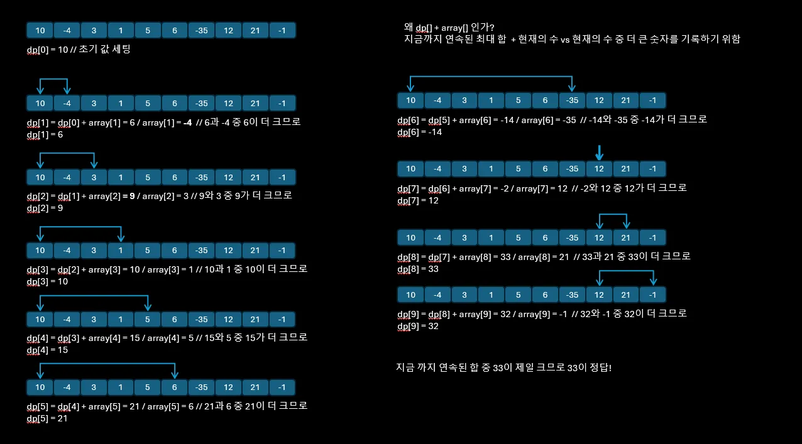

# DP (Dynamic Programming) 동적 계획법

## 동적계획법, DP?

- 동적 계획법, 알고리즘을 풀 때 흔히 언급되는 DP는 큰 문제를 작은 문제들로 나누어 푸는 방법
- 각 하이 문제들을 해결하고 저장하여 같은 하위 문제가 나왔을 때 이를 이용
- 쉽게 말해서 문제를 작게 나누고 해결한 값을 저장해서 활용한다는 것

## 예제

> <div align="center">
>  
> </div>

- 최대 부분 순열의 합을 구하는 문제로 연속된 숫자의 합이 가장 클 때를 선택
- dp 배열을 사용하여 숫자의 합을 구해나갈 때, 현재의 최적 값이 이전의 최적 값으로부터 구해낼 수 있기 때문
- `dp[n] = Math.max(dp[n - 1] + array[n], array[n])`;
- 이를 **점화식**이라고 부르며 DP 문제에서 점화식을 찾는 것이 가장 큰 핵심

## DP의 두 가지 해결 방법

기본적으로 DP를 풀기 위해서는 초기 값 설정이 필요

```java
dp[0] = array[0];
MAX = array[0];
```

### Memoization / Top-Down (재귀)

```java
private static int dynamic(int index) {
    if (dp[index] == null) {
        dp[index] = Math.max(dynamic(index-1) + array[index], array[index]);
        MAX = Math.max(MAX, dp[index]);
    }

    return dp[index];
}
```

- array 배열의 마지막 인덱스부터 시작하여 재귀를 통해 구함
- 위 dynamic 메서드에서도 dp[0]의 경우를 설정해주었기에 이후의 값을 차례대로 구해나가게 된다.

### Tabulation / Bottom-Up (반복문)

```java
for (int i = 1; i < N; i++) {
		dp[i] = Math.max(dp[i - 1] + arr[i], arr[i]);
		max = Math.max(max, dp[i]);
}
```

- 초기 값 이후 부터의 반복문을 시작하여 최댓값을 갱신

## 정리

- 하나의 문제를 작은 하위 문제로 나누어 해결
- 이전 계산 결과를 저장하여 동일한 계산을 반복하지 않아야 함
- 하위 문제의 최적 해를 통해 문제의 최적 해가 구성될 수 있는 구조
