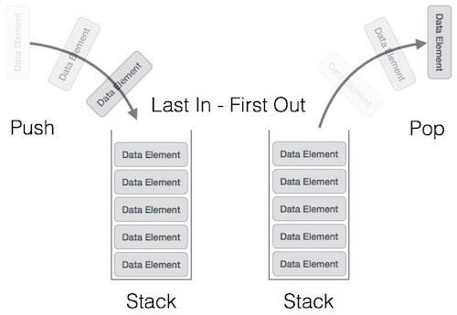
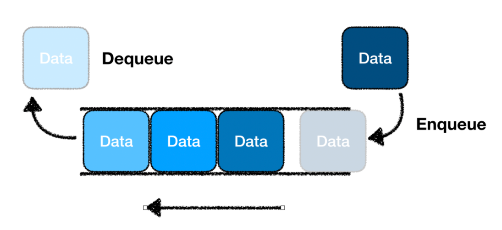
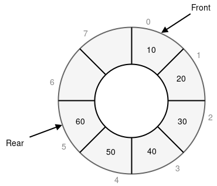

# 자료구조 - Stack, Queue, Circular Queue, Deque

---

## Stack (스택)

<div align="center">
  
</div>

### 개념

- **LIFO (Last In, First Out)** 구조
- 마지막에 추가된 데이터가 가장 먼저 제거됨

### 선언 방법 (java)

```java
imoprt java.util.*;
class StackEx {
    public static void main(String[] args) {

        Stack<자료형> s = new Stack<>();
    }
}
```

### 주요 연산

| 연산        | 설명                   | 시간 복잡도 |
| ----------- | ---------------------- | ----------- |
| `push()`    | 스택에 데이터 삽입     | O(1)        |
| `pop()`     | 스택에서 데이터제거    | O(1)        |
| `peek()`    | 맨 위 데이터 확인      | O(1)        |
| `isEmpty()` | 스택이 비어있는지 확인 | O(1)        |

### 사용되는 문제

- 괄호 검사 ([BOJ 9012번 - 괄호](https://www.acmicpc.net/problem/9012))
- 문자열 역순 출력 ([BOJ 4740번 - 거울, 오!거울](https://www.acmicpc.net/problem/4740))
- 후위 표기법 계산 ([BOJ 1935번 - 후위 표기식2](https://www.acmicpc.net/problem/1935))

---

## Queue (큐)

<div align="center">
  
</div>

### 개념

- **FIFO (First In, First Out)** 구조
- 먼저 들어온 데이터가 먼저 나가는 구조
- 선착순 처리 시스템에 적합

### 선언 방법 (java)

```java
imoprt java.util.*;
class QueueEx {
    public static void main(String[] args) {

        Queue<자료형> q = new LikedList<>();
    }
}
```

### 주요 연산

| 연산                 | 설명                 | 시간 복잡도 |
| -------------------- | -------------------- | ----------- |
| `add()`, `offer()`   | 큐에 데이터 삽입     | O(1)        |
| `remove()`, `poll()` | 큐에서 데이터 제거   | O(1)        |
| `peek()`             | 맨 앞 데이터 확인    | O(1)        |
| `isEmpty()`          | 큐가 비어있는지 확인 | O(1)        |

### 사용되는 문제

- BFS ([BOJ 1260 - DFS와 BFS](https://www.acmicpc.net/problem/1260))
- 프로세스 스케줄링 ([BOJ 1966 - 프린터 큐](https://www.acmicpc.net/problem/1966))
- 프린터 대기열 ([BOJ 11866 - 요세푸스 문제 0](https://www.acmicpc.net/problem/11866))

---

## Circular Queue (원형 큐)

<div align="center">
  
</div>

### 개념

- 배열로 구현한 큐에서 발생하는 **공간 낭비 문제 해결**
- 끝에 도달하면 처음으로 돌아가 **원형처럼 동작**

### 간단 구현 (by ChatGPT)

```
public class CircularQueue {
    private int[] queue;
    private int front;
    private int rear;
    private int size;

    public CircularQueue(int k) {
        size = k + 1;
        queue = new int[size];
        front = 0;
        rear = 0;
    }

    public boolean enqueue(int value) {
        if (isFull()) return false;
        queue[rear] = value;
        rear = (rear + 1) % size;
        return true;
    }

    public boolean dequeue() {
        if (isEmpty()) return false;
        front = (front + 1) % size;
        return true;
    }

    public int front() {
        if (isEmpty()) return -1;
        return queue[front];
    }

    public int rear() {
        if (isEmpty()) return -1;
        return queue[(rear - 1 + size) % size];
    }

    public boolean isEmpty() {
        return front == rear;
    }
}

```

### 주요 연산

| 연산        | 설명                 | 시간 복잡도 |
| ----------- | -------------------- | ----------- |
| `enqueue()` | 큐에 데이터 삽입     | O(1)        |
| `dequeue()` | 큐에서 데이터 제거   | O(1)        |
| `front()`   | 맨 앞 데이터 확인    | O(1)        |
| `rear()`    | 맨 뒤 데이터 확인    | O(1)        |
| `isEmpty()` | 큐가 비어있는지 확인 | O(1)        |

### 사용되는 문제

- 네트워크 버퍼 ([BOJ 15828번 - Router](https://www.acmicpc.net/problem/15828))
- 트래픽 제어 ([BOJ 11058번 - 크리보드](https://www.acmicpc.net/problem/11058))
- 고정 크기 큐가 필요한 시스템 ([BOJ 2164번 - 카드2](https://www.acmicpc.net/problem/2164))

---

## Deque (Double-Ended Queue, 덱)

<div align="center">
  
</div>

### 개념

- 양쪽 끝에서 삽입과 삭제가 가능한 선형 자료구조
- Stack과 Queue의 기능을 모두 지원

### 선언 방법 (java)

```java
imoprt java.util.*;
class DequeEx {
    public static void main(String[] args) {

        Deque<자료형> d = new ArrayDeque<>();
    }
}
```

### 주요 연산

| 연산                                                 | 설명               | 시간 복잡도 |
| ---------------------------------------------------- | ------------------ | ----------- |
| `addFirst()`, `offerFirst`                           | 앞쪽에 데이터 삽입 | O(1)        |
| `addLast()`, `add()`, `offerLast()`,`offer()`        | 뒤쪽에 데이터 삽입 | O(1)        |
| `remove()`, `removeFIrst()`, `poll()`, `pollFirst()` | 앞쪽 데이터 제거   | O(1)        |
| `removeLast()`, `pollLast()`                         | 뒤쪽 데이터 제거   | O(1)        |
| `getFirst()`, `peek()`, `peekFirst()`                | 앞쪽 데이터 확인   | O(1)        |
| `getLast()`, `peekLast()`                            | 뒤쪽 데이터 확인   | O(1)        |

> add와 offer의 차이 : addFirst()는 Dequeue 용량 초과시 예외가 발생, offerFirst()는 용량 초과시 false 리턴

### 사용되는 문제

- 슬라이딩 윈도우 알고리즘 ([BOJ 11003번 - 최솟값 찾기](https://www.acmicpc.net/problem/11003))
- 회문 검사 ([BOJ 10942번 - 팰린드롬?](https://www.acmicpc.net/problem/10942))
- BFS에서 양방향 탐색 ([BOJ 13913번 - 숨바꼭질4](https://www.acmicpc.net/problem/13913))

---

## 시간복잡도 정리

| 자료구조 | 삽입 | 삭제 | 탐색 |
| -------- | ---- | ---- | ---- |
| Stack    | O(1) | O(1) | O(n) |
| Queue    | O(1) | O(1) | O(n) |
| C-Queue  | O(1) | O(1) | O(n) |
| Deque    | O(1) | O(1) | O(n) |

---
