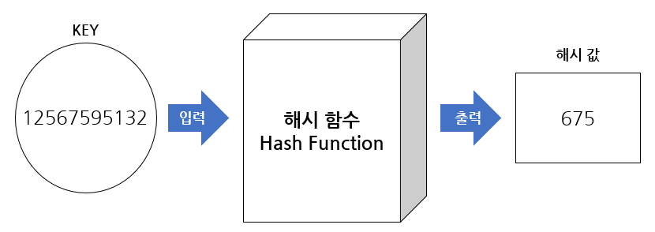

# 자료구조2 - String, Hash, HashMap

---

## String (문자열)

### 개념

- Java에서 문자열은 문자의 집합으로 나타내는 객체로, String 클래스는 불변이다.
- 한 번 생성된 문자열은 변경할 수 없으며, 문자열 조작 시 새로운 String 객체가 생성된다.

### 선언 방법 (java)

```java
String s1 = "Hello";              // String literal
String s2 = "Hello";              // String literal
String s3 = s1;                   // 같은 참조
String s4 = new String("Hello");  // String object (객체)
String s5 = new String("Hello");  // String object (객체)
```

<div align="center">
  
</div>

### 주의점

- 문자열 리터럴은 공통 풀에 공유 데이터로 저장이 되기 때문에 자바의 String은 불변으로 디자인 되었다. 즉, String이 만들어지면 수정이 불가하다.
  > String 객체는 수정 시 변경 불가능 하므로 객체를 변경할 수 없으므로 새로운 객체를 생성한다. 따라서 String 객체에 + 연산을 하면, 새로운 객체를 생성하고 또 소멸시키는 과정에서 큰 비용 낭비가 발생한다.

### StringBuilder, StringBuffer

- 위의 문제를 해결하기 위해 문자열 수정을 효율적으로 할 수 있는 StringBuilder와 StringBuffer라는 클래스가 있다.
- 이 두 클래스는 String과 달라 변경 가능하다.
- 기존의 문자열을 변경하고자 할 때 append() 메서드를 사용하여, 객체를 새롭게 생성하지 않고 기존의 문자열을 변경할 수 있다.

### 선언 방법

```java
StringBuilder sb = new StringBuilder("Hello");
sb.apend(" World");
System.out.println(sb);     // 출력: Hello World
// StringBuilder는 StringBuffer와 비교해서 성능이 더 좋지만 스레드에서 안전하지 않다.

StringBuffer sbf = new StringBuffer("Java");
sbf.insert(4, "Programming");
System.out.println(sbf);    // 출력  : Java Programming
// StringBuffer는 스레드에서 안전하다.
```

---

## Hash (해시)

### 개념

- 해시는 입력 데이터를 고정된 길이의 데이터로 변환된 값
- 해시 값, 해시 코드, 체크섬 이라고도 부른다.
- 해시의 값은 해시 함수에 의해서 얻게되는데 간단히 말해 데이터의 Key 값이 해시 함수를 통해서 변환된 간단한 정수이다.

<div align="center">
  
</div>

### 특징

- Key에 Value를 매핑할 수 있는 데이터 구조
- 해시 함수를 통해 키의 데이터를 배열에 저장할 수 있는 주소를 계산
- 키를 통해서 저장된 데이터를 빠르게 찾고 저장 및 탐색 속도가 획기적으로 빨라짐

### 해시 함수 (Hash Function)

- 해시 함수는 입력 받은 데이터를 해시 값으로 출력시키는 알고리즘
- 함수는 목적에 맞게 다양하게 설계되고 자료 구조, 캐시, 검색, 에러 검출, 암호 등에 유용하게 사용

```java
// 해시 함수 예시
Integer hashFunction(String key) {
    return (int) (key.charAt(0)) % 100;
}
// 입력 받은 키에서 문자의 0번에 해당하는 부분을 정수화하여 100으로 나눈뒤 나오는 나머지를 반환하는 함수
// 반환된 값은 배열의 인덱스가 되고 해당 인덱스에 맞게 저장
```

### 해시 테이블 (Hash Table)

- 해시 테이블은 키와 값을 함께 저장해 둔 데이터 구조
- 테이블에 데이터를 저장할 때 위치는 무작위로 지정되어 작성, 따라서 중간에 여유 공간이 발생 할 수도 있다.
<div align="center">
  
</div>

### 해싱(Hashing)

- 해싱은 해시 함수에서 해시를 출력하고, 해시 테이블에 저장하는 과정까지의 행위
<div align="center">
  
</div>

### 장/단점

- 장점
  - 데이터 저장 / 읽기 속도가 빠름
  - 해시는 키에 대한 데이터가 있는지 확인이 쉬움
- 단점
  - 읿반적으로 저장 공간이 많이 필요
  - 여러 키에 해당하는 주소가 동잃할 경우 충돌을 해결하기 위한 별도 자료구조 필요
- 주요 용도
  - 검색이 많이 필요한 경우
  - 저장, 삭제, 읽기가 빈번한 경우
  - 캐쉬 구현

### 충돌 해결 방법

- Chaining 기법 - 개방 해싱 또는 Open Hashing 기법 중 하나 - 충돌이 발생 했을 때 연결 리스트 자료구조를 사용해서 해결하는 방법
<div align="center">
  
</div>

- Linear Probing 기법
  - 폐쇄 해싱 또는 Close Hashing 기법 중 하나
  - 충돌이 발생했을 때 해당 해시 주소의 다음 주소부터 맨 처음까지 순회하며 빈 공간을 찾는 방식
  - 저장 공간 활용도를 높이기 위한 기법

---

## HashMap(해시맵)

### 개념

- Map은 키와 값으로 구성된 Entry 객체를 저장하는 구조를 가지고 있는 자료구조
- HashMap은 해시 함수를 통해 Key와 Value가 저장되는 위치를 결정하므로 사용자는 그 위치를 알 수 없고, 삽입되는 순서와 들어있는 위치 또한 관계가 없다.
<div align="center">
  
</div>

### 선언 방법

```java
HashMap<String,String> map1 = new HashMap<String,String>(); //HashMap생성
HashMap<String,String> map2 = new HashMap<>(map1); // map1의 모든 값을 가진 HashMap생성
HashMap<String,String> map3 = new HashMap<>(10); // 초기 용량(capacity)지정
```

### 주요 연산

| 연산                             | 설명                                 |
| -------------------------------- | ------------------------------------ |
| `put(key, value)`                | HashMap 값 추가                      |
| `get(key)`                       | HashMap Value 반환                   |
| `remove(key)`                    | HashMap 값 삭제                      |
| `clear()`                        | HashMap 초기화                       |
| `containsKey(key)`               | Key 존재 유무 확인                   |
| `containsValue(value)`           | Value 존재 유무 확인                 |
| `Set<Map.Entry<K,V>> entrySet()` | Key = Value 형태로 묶어 Set으로 반환 |
| `Set<K> keySet()`                | Key만 Set으로 반환                   |

### 예시, 사용방법

```java
import java.util.*;

public class HashMapExample {
    public static void main(String[] args) {
        // HashMap 생성
        Map<String, Integer> map = new HashMap<>();

        // put(key, value): 값 추가
        map.put("apple", 3);
        map.put("banana", 5);
        map.put("orange", 2);

        // get(key): 값 조회
        System.out.println("apple의 개수: " + map.get("apple")); // 출력: 3

        // remove(key): 값 삭제
        map.remove("banana");

        // containKey(key): 키 존재 여부 확인
        System.out.println(map.containKey("banana")); // 출력: true

        // containsValue(value): 값 존재 여부 확인
        System.out.println(map.containsValue(2));  // 출력: true

        // keySet(): 키만 Set으로 반환
        Set<String> keys = map.keySet();
        System.out.println("Key 목록: " + keys); // 출력: [apple, orange]

        // entrySet(): Key = Value 형태로 Set 반환
        Set<Map.Entry<String, Integer>> entries = map.entrySet();
        for (Map.Entry<String, Integer> entry : entries) {
            System.out.println(entry.getKey() + " = " + entry.getValue());
        }
        // 출력 apple = 3
        //      orange = 2

        // clear(): 모든 값 삭제
        map.clear();
        System.out.println("초기화 이후 크기: " + map.size()); // 출력: 초기화 이후 크기: 0
    }
}
```
