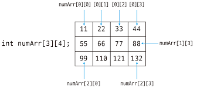

# 2차원 배열

---

### 개념

- 2차원 배열은 배열 안에 배열이 포함된 형태로 구성되어 있으며, 행과 열의 형태를 갖는다.
- 표나 행렬과 같은 구조를 표현할 때 사용된다.
- Java에서는 1차원 배열의 배열로 구현되어 있다.
  > 예시: `int[][] arr = new int[3][4];`

### 선언 및 초기화

- 기본 선언

```java
int[][] arr = new int[3][4]; // 3행 4열 배열 (초기값 0)
```

- 선언 + 초기화

```java
int[][] arr = {
    {1, 2, 3},
    {4, 5, 6}
};
```

-가변 배열

```java
int[][] arr = new int[3][];
arr[0] = new int[2]; // 0행은 2열
arr[1] = new int[3]; // 1행은 3열
arr[2] = new int[1]; // 2행은 1열
```

> Java의 2차원 **가변 배열**이 가능하며, 각 행의 열 개수가 다를 수 있다.

### 인덱스 구조

- arr[i][j]
  - i번째 행, j번째 열의 원소
  - i는 row index, j는 column index

<div align="center">
  
</div>

### 배열 순회 방법

- 일반 for문

```java
for (int i = 0; i < arr.length; i++) {
    for (int j = 0; j < arr[i].length; j++) {
        System.out.print(arr[i][j] + " ");
    }
    System.out.println();
}
```

- 향상된 for문

```java
for (int[] row : arr) {
    for (int val : row) {
        System.out.print(val + " ");
    }
    System.out.println();
}
```

### 장점과 단점

- 장점
  - 데이터를 표 형태로 표현 가능
  - 인덱스를 이용한 빠른 접근 가능
  - 행/열 기반의 알고리즘에 유용
- 단점
  - 크기 변경이 어렵다 (고정된 크기)
  - 메모리 사용량이 많을 수 있다.
  - 복잡한 구조는 List<List<>>가 더 유연

### 사용되는 문제 예시

- 행렬 연산
- 게임 맵 구성(ex: 미로 찾기)
- 그래프 표현(인접 행렬)
- 좌표 기반 로직 (ex: BFS/DFS 탐색)

### List<List<Integer>>와 의 차이점

|       배열       |       리스트       |
| :--------------: | :----------------: |
|    크기 고정     |     크기 가변      |
|    빠른 접근     |     구조 유연      |
| 가볍고 성능 좋음 | 다차원 구조에 적합 |
