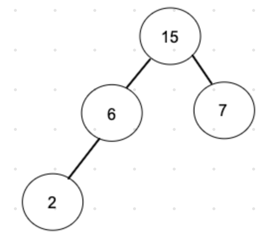
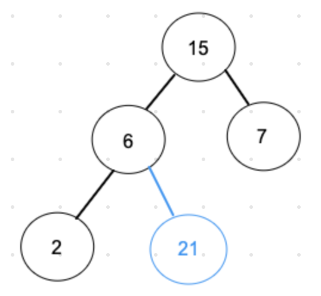
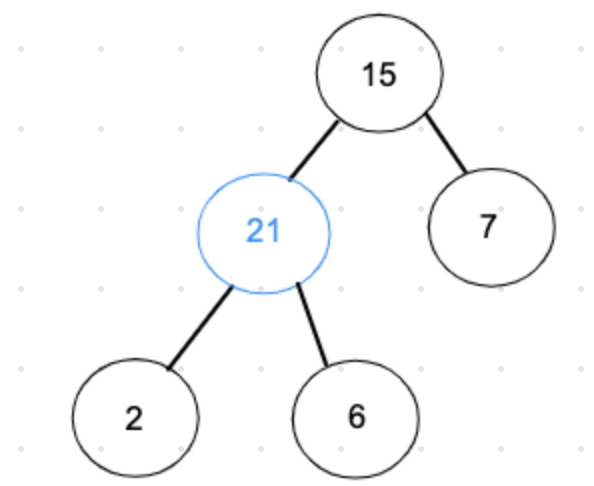
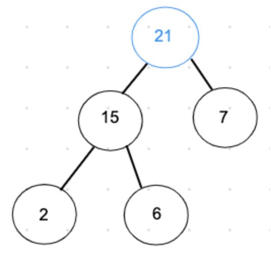
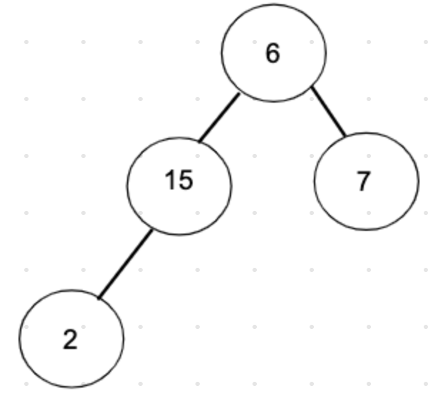
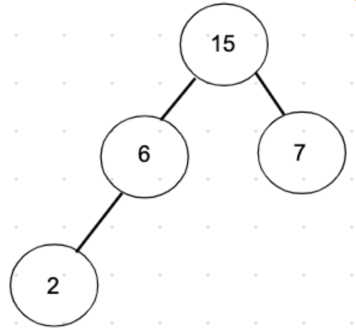

# Tree (트리)

- 트리는 값을 가진 `노드(Node)`와 이 노드들을 연결해주는 `간선(Edge)` 으로 이루어져 있다.

<div align="center">
  
</div>

- 그림 상 데이터 1을 가진 노드가 `루트(Root) 노드`이다.
- 모든 노드들은 0개 이상의 자식(Child) 노드를 갖고 있으며 보통 부모 - 자식 관계로 부른다.

### Tree의 특징

- 트리에는 사이클이 존재할 수 없다. (만약 사이클이 만들어진다면, 그것은 트리가 아니라 그래프다)
- 모든 노드는 자료형으로 표현이 가능하다.
- 루트에서 한 노드로 가는 경로는 유일한 경로 뿐이다.
- 노드의 개수가 N개면, 간선은 N - 1개를 가진다.

### Tree의 순회 방식 (위 사진 기준)

- 전위 순회(pre-order)

  - 각 루트(Root)를 순차적으로 먼저 방문하는 방식
    > 1 → 2 → 4 → 8 → 9 → 5 → 10 → 11 → 3 → 6 → 13 → 7 → 14

- 중위 순회(in-order)

  - 왼쪽 하위 트리를 방문 후 루트(Root)를 방문하는 방식
    > 8 → 4 → 9 → 2 → 10 → 5 → 11 → 1 → 6 → 13 → 3 → 14 → 7

- 후위 순회(post-order)

  - 왼쪽 하위 트리부터 하위를 모두 방문 후 루트(Root)를 방분하는 방식
    > 8 → 9 → 4 → 10 → 11 → 5 → 2 → 13 → 6 → 14 → 7 → 3 → 1

- 레벨 순회(level-order)
  - 루트(Root)부터 계층 별로 방문하는 방식
    > 1 → 2 → 3 → 4 → 5 → 6 → 7 → 8 → 9 → 10 → 11 → 13 → 14

### Tree 구현 방법

```java
//생성자
public class Tree<T> {
    private Node<T> root;
    private int size;
    public Tree(){
        this(null);
    }

    public Tree(Node<T> root){
        this.root = root;
        if(root != null)
            size = 1;
    }
}
```

```java
//메서드
    public int size(){ return this.size; }
    public Node<T> getRoot(){ return this.root;  }

    public Tree<T> setRoot(T element){
        if(root == null)
            size = 1;
        this.root = new Node(element);
        return this;
    }

    public Tree<T> setRoot(Node<T> element){
        if(root == null)
            size = 1;
        this.root = element;
        return this;
    }

    public Node<T> addLeft(Node<T> parent, Node<T> child){
        if(parent.getLeft() != null){
            System.out.println("Already have left");
            return null;
        }
        size++;
        parent.setLeft(child);
        return parent;
    }

    public Node<T> addRight(Node<T> parent, Node<T> child){
        if(parent.getRight() != null){
            System.out.println("Already have right");
            return null;
        }
        size++;
        parent.setRight(child);
        return parent;
    }

    public Node<T> removeLeft(Node<T> parent){
        Node<T> target = parent.getLeft();
        if(target != null)
            size--;
        parent.setLeft(null);
        return target;
    }

    public Node<T> removeRight(Node<T> parent){
        Node<T> target = parent.getRight();
        if(target != null)
            size--;
        parent.setRight(null);
        return target;
    }
```

# Heap(힙)

- 힙은 우선순위 위해 만들어진 자료구조이다.
  > 우선순위 큐 : 우선순위의 개념을 큐에 도입한 자료구조
- 힙은 완전 이진 트리의 일종이다.
- 힙 트리는 중복된 값을 허용한다.

### 힙의 종류

- 최대 힙
  - 부모 노드의 키 값이 자식 노드의 키 값보다 크거나 같은 완전 이진 트리
- 최소 힙
  - 부모 노드의 키 값이 자식 노드의 키 값보다 작거나 같은 완전 이진 트리

<div align="center">
  
</div>

### 힙과 우선순위 큐의 차이

- 힙은 자료구조이지만 우선순위 큐는 추상적인 자료형이다.
- 따라서 heap을 이용해 우선순위 큐를 만들 수 있는 것이다.

  > **추상자료형**이란 실제로 구현 방법이 명시하고 있지 않고 어떤 동작들인지 개념적인 부분만 설명한 것

  > **자료구조**는 실제로 구현한 것을 말하며 이를 통해 시간 복잡도를 알 수 있다.

### 힙 INSERT 과정

1. 초기 상태의 heap 구조
<div align="center">
  
</div>

2. binary tree의 마지막 비어있는 공간에 원소를 추가한다.
<div align="center">
  
</div>

3. heap 구조인지 확인을 하고 heap 구조가 아니라면 heap 구조 형태로 만들어준다.
<div align="center">
  
</div>

4. 위의 방식을 반복하여 최종적인 heap 구조 형태를 얻어낸다.
<div align="center">
  
</div>

# 힙 DELETE 과정

1. max heap 상태에서 원소를 제거할 때는 루트 노드가 제거된다.
<div align="center">
  
</div>

2. 루트 노드 자리를 가장 마지막 노드로 채워준다.
<div align="center">
  
</div>

3. heap 구조인지 확인하고 아니라면 heap 구조로 만들어준다.
<div align="center">
  
</div>
