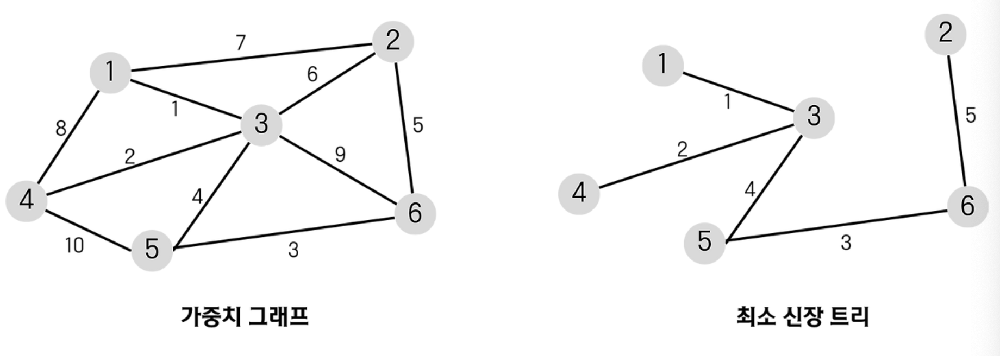

# 그리디(Greedy)
## 그리디 알고리즘
- 그리디 알고리즘은 일반적으로 optimization problem을 해결하기 위한 방법
- 그리디 알고리즘은 해를 구하기 위하여 반복적으로 어떤 선택을 하는데 이때 현 상황에서 가장 좋은 것을 매번 선택하여 문제를 해결
- **근시안적**인 선택으로 부분적인 최적해를 찾고 이들을 모아 문제에 대한 최적해를 얻고자 하는 것

## 그리디 알고리즘으로 문제를 해결하는 방법
- 선택 절차 : 현재 상태에서 최적의 해답을 선택
- 적절성 검사 : 선택된 해가 문제의 조건을 만족하는지 검사
- 해답 검사 : 문제가 해결되었는지 검사하고, 해결되지 않았다면 선택 절차로 돌아감

## 그리디를 사용하는 경우
- 탐욕 선택 속성 : 앞의 선택이 이후의 선택에 영향을 주지 않는다.
- 최적 부분 구조 : 문제에 대한 최종 해결 방법은 부분 문제에 대한 최적 문제 해결 방법으로 구성된다.
> 위의 조건이 만족하지 않는 경우, **최적의 해**를 보장하지 못한다.

## 대표적인 그리디 알고리즘의 종류
| Algorithm       | 목적                                   | 설명                                          |
|-----------------|--------------------------------------|---------------------------------------------|
| 프림(Prim)        | N개의 노드에 대한 최소 신장 트리(MST)를 찾는다.       | 서브트리를 확장하면서 MST를 찾는다.                       |
| 크루스칼(Kruskal)   | N개의 노드에 대한 최소 신장 트리(MST)를 찾는다.       | 가중치가 가장 낮은 간선을 선택하며, 사이클이 생기지 않도록 연결하여 MST를 만든다.             |
| 다익스트라(Dijkstra) | 주어진 정점에서 가장 가까운 정점을 반복적으로 선택하며 최단 경로를 갱신한다.      | 주어진 정점에서 가장 가까운 정점을 찾고, 그 다음을 정점을 반복해서 찾는다. |
| 허프만 트리 & 코드     | 문서의 압축을 위해 문자들의 빈도 수에 따라 코드 값을 부여한다. | 출현 빈도가 높은 문자일수록 더 짧은 이진 코드를 부여하며, 전체 메시지의 길이를 최소화한다. |

### 최소 신장 트리 (MST)
- 최소 신장 트리란 주어진 가중치 그래프에서 사이클 없이 모든 점들을 연결시킨 트리들 중 선분들의 가중치 합이 최소인 트리
- 동작 원리
  - 간선의 가중치의 합이 최소이어야 한다.
  - 반드시 (n - 1)개의 간선만 사용해야 한다.
  - 사이클이 포함되어서는 안된다.

  

## 그리디 알고리즘 단점
- 그리디 알고리즘은 단지 상황판단의 상황에서 근시안적으로 최적해를 탐색하므로 **Global에서는 최적의 값이 아닐 수 있다**.