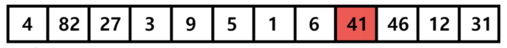
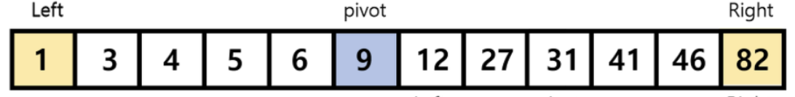
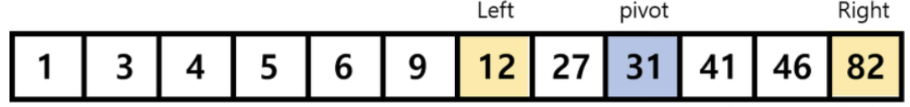
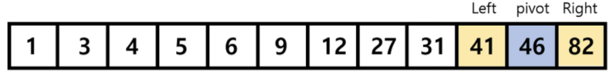
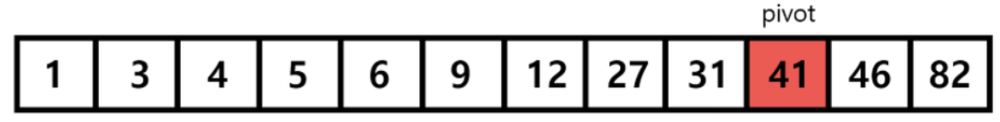

# BinarySearch (이분 탐색)

## 이분 탐색이란

- 이분 탐색은 정렬된 배열에서 특정 값을 빠르게 찾는 알고리즘
- 탐색 범위를 반복적으로 절반씩 줄여가면서 찾고자 하는 값을 찾는 바업
- 시간 복잡도는 O(log N)

## 이분 탐색 원리

1. 현재 데이터에서 중앙값을 선택
2. 중앙값 > 타겟 일 때 중앙값 기준 왼쪽의 데이터를 선택
3. 중앙값 < 타겟 일 때 중앙값 기준 오른쪽의 데이터를 선택
4. 위 과정을 반복하다 중앙값 == 타겟 데이터 일 때 탐색 종료

## 이부 탐색의 전제 조건

- 데이터가 반드시 정렬되어 있어야 함
  - 오름차순 또는 내림차순 정렬되어 있어야만 이분 탐색을 적용할 수 있음
- 랜덤 액세스가 가능한 자료구조
  - 배열(리스트)처럼 인덱스를 통해 빠르게 접근할 수 있는 구조여야 함

## 예시 (원소 41을 찾는 과정)

<div align="center">
  
</div>
- 정렬 진행

<div align="center">
  
</div>
- 맨 왼쪽 left 
- 오른쪽 Right 
- 중앙  pivot

<div align="center">
  
</div>
- pivot < target
- left = pivot + 1
- pivot 중앙값 세팅

<div align="center">
  
</div>
- pivot < target
- left = pivot + 1
- pivot 중앙값 세팅
          
<div align="center">
  
</div>
- pivot == target
- 탐색 종료

## 코드 예시

```java
// 반복문 방식
int binarySearch(int[] arr, int target) {
    int left = 0;
    int right = arr.length - 1;

    while (left <= right) {
        int mid = (left + right) / 2;

        if (arr[mid] == target) return mid;
        else if (arr[mid] < target) left = mid + 1;
        else right = mid - 1;
    }

    return -1; // target이 존재하지 않는 경우
}
```

```java
//재귀 방식
int binarySearchRecursive(int[] arr, int target, int left, int right) {
    if (left > right) return -1;

    int mid = (left + right) / 2;

    if (arr[mid] == target) return mid;
    else if (arr[mid] < target) return binarySearchRecursive(arr, target, mid + 1, right);
    else return binarySearchRecursive(arr, target, left, mid - 1);
}
```

## 이진 검색을 문제에 적용하는 경우

- 최적화 문제를 결정 문제로 바꿔서 생각하는 경우가 많음
- 결정 문제의 참/거짓의 결과 이용
- 이분 검색으로 가장 최적의 해 검색
